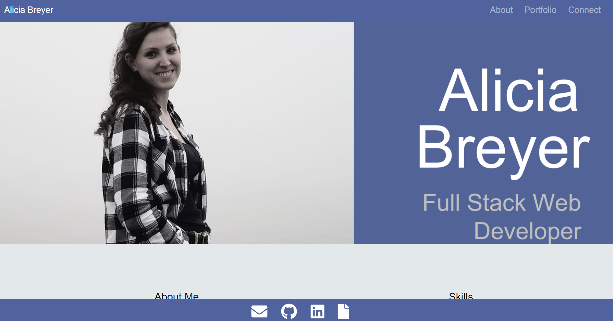

# ABreyer-React-Portfolio

 

## Description

React portfolio page. View an about me section, projects worked on, and ways to connect at the [live site](https://breyera.github.io/ABreyer-React-Portfolio/).

## How To

- Go to [live site](https://breyera.github.io/ABreyer-React-Portfolio/)

### Important Links

- [Live site](https://breyera.github.io/ABreyer-React-Portfolio/)

### Images

### License

MIT License
